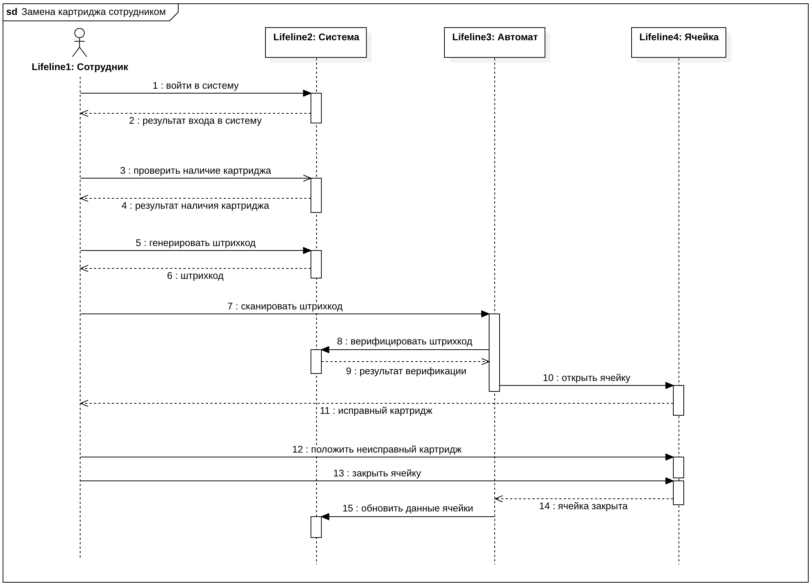
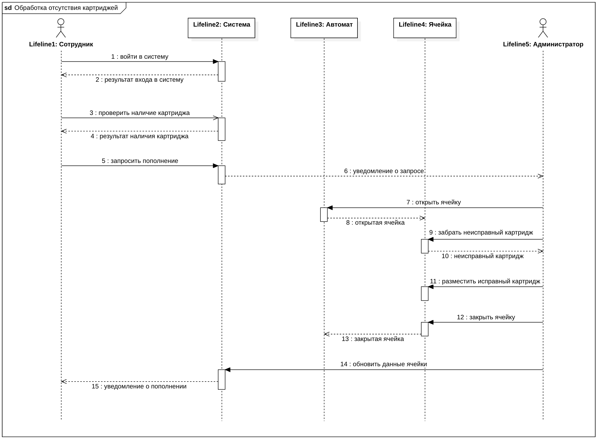
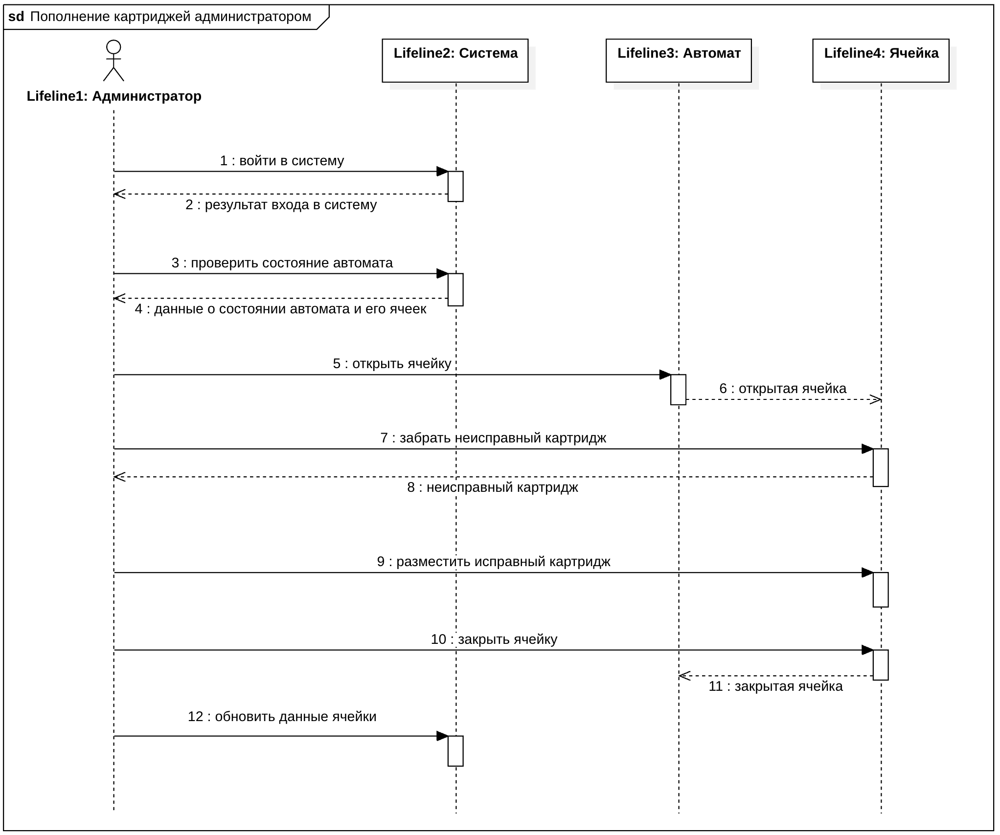
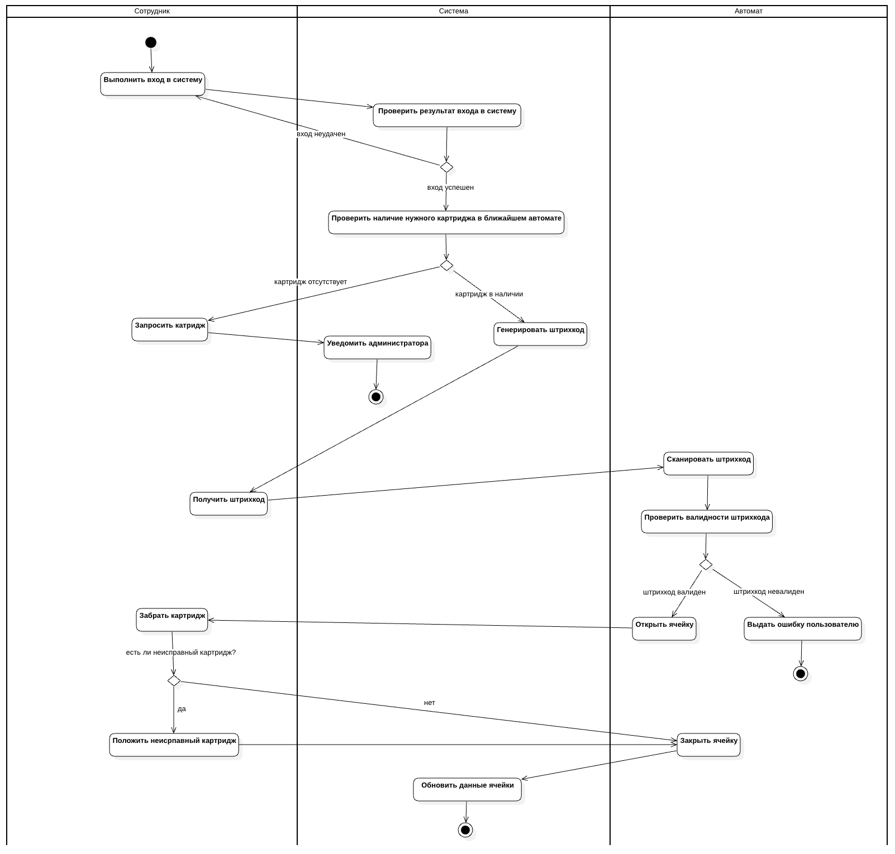

# Система автоматизированной замены картриджей для принтеров

## Навигация

- [Описание предметной области](#описание-предметной-области)
    - [1. Общая концепция системы](#1-общая-концепция-системы)
    - [2. Участники системы](#2-участники-системы)
    - [3. Функциональные требования](#3-функциональные-требования)
    - [4. Обработка отсутствия картриджей](#4-обработка-отсутствия-картриджей)
    - [5. Дополнительные требования](#5-дополнительные-требования)
- [UML-диаграммы](#uml-диаграммы)
    - [Диаграмма классов](#диаграмма-классов)
    - [Диаграммы последовательности](#диаграммы-последовательности)
    - [Диаграммы деятельности](#диаграммы-деятельности)

# Описание предметной области

**Проект:** Система автоматизированной замены картриджей для принтеров

**Цель системы:** Обеспечение автоматизированной выдачи и замены картриджей для принтеров с использованием
специализированных автоматов, оснащенных сканерами штрих-кодов.

---

### 1. Общая концепция системы

На предприятии устанавливаются автоматы с ячейками, оборудованные сканерами штрих-кодов. Эти автоматы могут находиться в
разных организациях и иметь различные адреса.

Картриджи в системе бывают разных моделей, соответствующих различным моделям принтеров.

---

### 2. Участники системы

- **Администратор системы** – ответственный за учет и пополнение картриджей, контроль их состояния, а также обработку
  запросов на пополнение.
- **Сотрудник (пользователь)** – получает картридж из автомата для замены, при необходимости возвращает неисправный
  картридж.
- **Система** – выполняет обработку запросов, генерирует штрих-коды, ведет учет картриджей и пользователей, а также
  предоставляет администратору данные о состоянии автоматов.

---

### 3. Функциональные требования

#### 3.1 Действия администратора

- Размещает картриджи в ячейках автомата и фиксирует в системе информацию о том, какой картридж в какой ячейке
  находится.
- Систематически проверяет и обновляет содержимое ячеек, забирая неисправные картриджи и пополняя запас картриджей.
- Обрабатывает запросы от сотрудников на пополнение запасов картриджей определенных моделей.
- Получает актуальную информацию о количестве исправных и неисправных картриджей в конкретном автомате.
- Имеет возможность просматривать информацию о содержимом каждой ячейки.

#### 3.2 Действия сотрудника (пользователя)

- Аутентифицируется в системе перед получением картриджа.
- Проверяет в системе наличие нужного картриджа в ближайшем автомате.
- В случае наличия подходящего картриджа, получает сгенерированный системой одноразовый штрих-код для его получения.
- Вводит полученный код в автомат, после чего система открывает соответствующую ячейку.
- При необходимости помещает неисправный картридж в ячейку и фиксирует это действие в системе.
- Система фиксирует информацию о том, какой сотрудник получил картридж и какой картридж он вернул.

#### 3.3 Действия системы

- Генерирует штрих-коды для выдачи картриджей сотрудникам.
- Обрабатывает запросы на наличие картриджей в автоматах.
- Ведет учет выданных и возвращенных картриджей, связывая их с конкретными сотрудниками.
- Обновляет данные о состоянии автоматов и ячеек, фиксируя количество исправных и неисправных картриджей.
- Предоставляет администратору актуальную информацию о наличии картриджей и необходимости пополнения запасов.

---

### 4. Обработка отсутствия картриджей

- Если в ячейках нет нужного картриджа, сотрудник видит в системе, что он отсутствует.
- Сотрудник может отправить запрос на пополнение, указав необходимую модель картриджа.
- Администратор получает уведомление о необходимости пополнения запаса картриджей данной модели.

---

### 5. Дополнительные требования

- Система должна вести учет выданных картриджей, связывая их с конкретными сотрудниками.
- Администратор должен иметь доступ к данным о количестве исправных и неисправных картриджей в каждом автомате и в
  каждой ячейке.

# UML-диаграммы

## Диаграмма классов

## Описание классов

### 1. Класс `Автомат`

**Атрибуты:**

- `ID: int` — идентификатор автомата.
- `Адрес: str` — местоположение автомата.
- `Ячейки: List<Ячейка>` — список ячеек, содержащихся в автомате.

**Методы:**

- `сканировать()` — сканирует штрих-код картриджа.
- `открыть_ячейку(штрихкод: int)` — открывает ячейку.
- `обновить_состояние_ячейки(id_ячейки: int, картридж: Картридж)` — обновляет состояние ячейки, после замены картриджа.

---

### 2. Класс `Ячейка`

**Атрибуты:**

- `ID: int` — идентификатор ячейки.
- `Номер: int` — порядковый номер ячейки в автомате.
- `Картридж: Картридж` — картридж, хранящийся в ячейке.
- `Состояние: str` — текущее состояние ячейки (Состояния: `свободен` — картридж отсутствует в ячейке, `исправен` — в
  ячейке лежит **исправный** картридж, `неисправен` — в ячейке лежит **неисправный** картридж).

---

### 3. Класс `Картридж`

**Атрибуты:**

- `ID: int` — идентификатор картриджа.
- `Модель: str` — модель картриджа.
- `Статус: str` — текущее состояние картриджа (Состояния: `исправен`, `неисправен`).

---

### 4. Класс `Система`

**Атрибуты:**

- `Пользователи: List<Пользователь>` — список зарегистрированных пользователей.
- `Администраторы: List<Администратор>` — список администраторов системы.
- `Автоматы: List<Автомат>` — список автоматов, подключенных к системе.

**Методы:**

- `генерировать_штрихкод(id_сотрудника: int, модель_картриджа: str)` — генерирует уникальный штрих-код для выдачи
  картриджа.
- `учёт_выдачи_картриджа(id_сотрудника: int, id_картриджа: int)` — фиксирует выдачу картриджа сотруднику.
- `учет_возврата_картриджа(id_сотрудника: int, id_картриджа: int)` — фиксирует возврат картриджа в систему.
- `уведомить_администратора(id_администратора: int)` — отправляет уведомление администратору о необходимости пополнения
  картриджей.

---

### 5. Класс `Сотрудник`

**Атрибуты:**

- `ID: int` — идентификатор сотрудника.
- `ФИО: str` — фамилия, имя, отчество сотрудника.
- `Логин: str` — учетная запись сотрудника в системе.
- `Пароль: str` — пароль для входа.

**Методы:**

- `войти_в_систему(логин: str, пароль: str)` — вход пользователя в систему.
- `проверить_наличие_картриджа(модель: str)` — проверяет, есть ли картридж нужной модели в автоматах.
- `запросить_штрихкод(модель: str)` — запрашивает штрих-код для получения картриджа.
- `получить_картридж(штрихкод: int)` — использует штрих-код для получения картриджа из автомата.
- `вернуть_картридж(id_картриджа: int)` — возвращает картридж обратно в автомат.
- `запросить_пополнение(модель: str)` — отправляет запрос администратору на пополнение картриджей.

---

### 6. Класс `Администратор`

**Атрибуты:**

- `ID: int` — идентификатор администратора.
- `ФИО: str` — фамилия, имя, отчество администратора.
- `Логин: str` — учетная запись администратора в системе.
- `Пароль: str` — пароль для входа.

**Методы:**

- `войти_в_систему(логин: str, пароль: str)` — вход администратора в систему.
- `проверить_состояние_автомата(id_автомата: int)` — проверяет текущее состояние автомата и его ячеек.
- `забрать_картридж(id_картриджа: int, id_ячейки: int)` — забирает картридж в указанной ячейке автомата.
- `разместить_картридж(id_картриджа: int, id_ячейки: int)` — размещает картридж в указанной ячейке автомата.
- `обновить_данные_ячейки()` — обновляет информацию о ячейке, заменяя неисправные картриджи на новые.

## Диаграммы последовательности

### Получение исправного картриджа сотрудником

---

### Получение исправного и возврат неисправного картриджа сотрудником

---

### Обработка отсутствия картриджей

---

### Пополнение картриджей администратором

## Диаграммы деятельности

### Замена картриджа сотрудником

---

### Пополнение картриджей администратором

